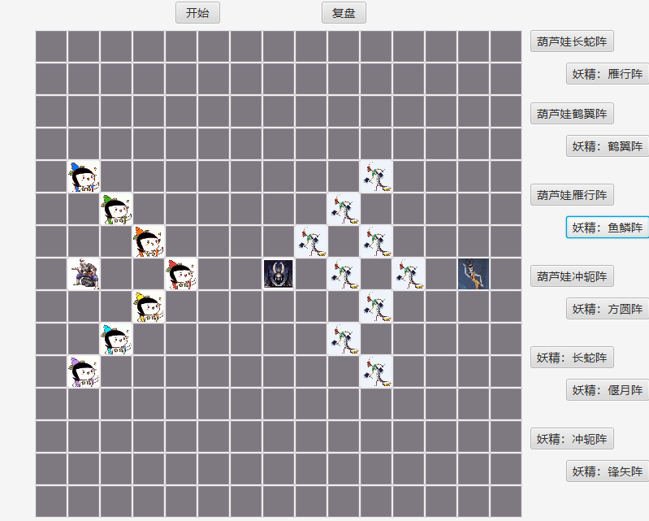
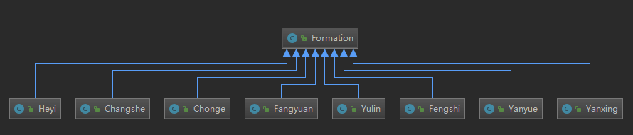
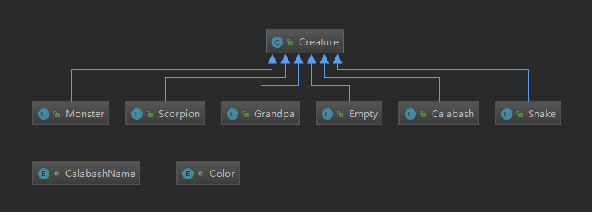
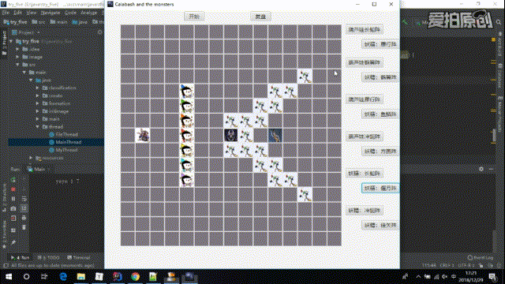
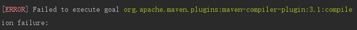
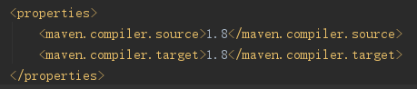
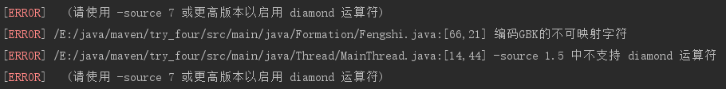

# 葫芦娃实验报告

#### 姓名  倪润涛         学号  161220094

#### 实验环境    Windows10操作系统，   IntelliJ IDEA 2018.2.4 x64，   java jdk8

## 第一部分：总体描述

#### 战斗方式：

相遇之时一决雌雄！

设计的战斗方式为近战，只有双方阵营的生物处在相邻的单元格时，才会触发战斗。


与图中红色格子相邻的只有绿色格子，灰色格子与红色格子不相邻。

#### 战斗空间：

​	在一个15×15的二维矩阵格子上，葫芦娃与妖精双方排好队形准备战斗。



葫芦娃总是在空间左侧排好阵型，妖精总是在空间右侧排好阵型。葫芦娃可供选择的阵有四个，分别是：长蛇阵、鹤翼阵、雁行阵、冲轭阵(其他四种阵型因为人数限制葫芦娃一方无法摆出)，妖精一方可以排出全部八种阵型。在战斗开始之前的任何时刻，玩家都可选择更换双方阵型。

当双方排好阵后，点击开始按钮即展开战斗(或者直接按下空格键，程序会调用默认阵型并展开战斗)。

#### 多线程部分

每个生物体都是一个线程，多个线程同时运行，共享地图信息。当任何一个线程对共享信息进行操作时，共享数据会在此时被锁定，以保证线程安全，同时也避免了多个生物体跑到同一个单元格、多个生物体杀死一个生物体的问题。

#### 判断获胜方

判断获胜方有两个层面的意思：

第一个层面是大局上的胜利，是妖精一方获胜还是葫芦娃一方得胜？

第二个层面是局部的胜利，当两个阵营中的两个个体相遇，一决生死时，用什么决定哪一个存活？

解决第一个问题所采用的办法是在三十秒内，若战斗结束，则仍有生物存活一方获胜；第二个问题的解决办法是以一个根据生物体战斗力所计算出的获胜概率，随机确定获胜者。

#### 回放

将战斗中的数据信息保存为一个.txt文件，点击回放按钮后，读取该文件进行回放。因为是以字符的方式保存生物体位置信息，所以每次战斗所产生的文件不会超过200KB。


## 第二部分：细节阐述

#### JavaFX

采用scene builder来设计JavaFX界面，拖拽操作的方式降低了自己编写fxml文件的难度。

#### maven

整个工程以maven组织，运行起来比较简单。

#### 模块说明

**Main包：**

包括两个类，主函数**Main类**和**MainControl类**，用于和用户交互。

MainControl中设置了十四个按钮，四个葫芦娃阵型按钮，八个妖精阵型按钮，一个开始按钮，一个复盘按钮。

**Formation包：**

包括九个类，一个Formation基类和八个阵型子类。继承关系如下图所示：



在阵型子类中让生物体“复苏”。

**create包：**

包括七个类，一个Creature基类和六个生物体子类，另外还包含两个葫芦娃的枚举类型。



Creature基类中有以下几种对生物体的基础描述

```java
public int power;   		//力量
public int speed;   		//速度
public int agility; 		//敏捷
public int X;       		//x轴坐标
public int Y;       		//y轴坐标
public boolean justorevil;  //所属阵营
public String name; 		//名称
```

每一个生物体都有这七个基础属性，前三个属性用来描述生物体的战斗力。因为葫芦娃的特殊性，所以用枚举类型CalabashName和Color来描述他们各自的名称和颜色信息

**Classification包：**

只有一个类，Classification类，用来描述生物体所属阵营。

**InitImage包：**

只有一个InitImage类，用来把图片加载到GUI界面上。

**Thread包：**

包含三个类，一个主线程类MainThread，一个子线程类MyThread，以及一个文件类。主线程类在开启战斗时创建，子线程类由主线程类创建，每一个子线程类对应一个生物体对象。文件类在复盘的时候创建。

#### 二维空间的产生

​	每个方格都是拖拽在JavaFX界面上的矩形，组成了一个15×15的二维矩阵，在这个二维矩阵上覆盖了JavaFX中的canvas控件，用以获得二维矩阵的像素点坐标。

#### 运行流程

​	有两种方式开启战斗，一种是当程序运行起来后，直接按下空格键选择默认阵型进行战斗，另一种是玩家自主选择合适的阵型，然后点击开始按钮进行战斗。

**摆阵：**


##### 自主择阵的方式下：

​	当玩家为葫芦娃选择一种阵型后，程序将进入阵型类执行，在具体的阵型中，会让葫芦娃“活过来”，并将他们安排在二维矩阵中每个个体应当处于的位置。位置信息用一个全局的地图表存储。该地图表为

```java
List<Creature> fieldlist
```

​	地图表大小为225，每个元素代表二维矩阵中的一个格子上站立的生物体。该地图表初始化为“Empty”生物体，代表所有位置都没有生物站立。在具体的阵型中，当为葫芦娃或妖精排出阵型后，地图表对应位置原本的“Empty”类型生物体将被葫芦娃或妖精替换。

​	当双方都排好阵型后，点击开始按钮，程序创建一个主线程，这个主线程执行两部分操作：第一部分是刷新战斗界面显示并将战斗画面记录下来，第二部分是为每一个生物体创建一个线程。这样会避免在每个生物体的线程中直接刷新界面造成线程不安全的问题。在每个生物体的线程中，他们将调用各自的move方法进行移动，倘若检测到自己的邻居有对手，双方将会一决雌雄。

```java
//在主线程的run方法里为每个生物体对象创建线程
for(int i=0;i<fieldlist.size();i++)
{
    if(fieldlist.get(i).name!="empty")
    {
        allThread.add(new Thread(new MyThread(mainCanvas,fieldlist.get(i),new ReentrantLock(),fieldlist)));
    }
}
for (Thread t:allThread) {
    t.start();
}
```

```java
//在主线程的run方法里刷新界面并记录界面数据
InitImage.setImage(mainCanvas.getGraphicsContext2D(), fieldlist);
writeFile();
```


​	胜负的判定来源于两个随机数，这两个随机数的取值范围上限是战斗双方战斗力的值。战斗力被描述为三种属性：力量、敏捷、速度。对于不同的生物体，这三种属性的初始值不同，并且战斗力并非是这三种属性的简单叠加，生成战斗力的计算方式为：战斗力 = a*力量 + b*敏捷+c*速度。a,b,c的取值与每个生物体的能力侧重有关，比如对于葫芦娃中的大娃来说，他力量初始值比别的要高一些，同时在战斗中，他的战力更多来源于力量，所以a的取值也会相对较高。生成两个随机数后，将会选取随即数大的一方作为获胜方，失败的一方将会变成“尸体”留在原地，同时作为路障拦在那里。

​	程序中同时也设置了随机死亡与消失机制——生物体掉入对方之前设下的陷阱中，将有可能死亡并留下“尸体”，也有可能直接消失在地图中。而且，已经成为“尸体”的生物体也有可能消失在地图中，以此来保证战斗的结果永远不可能在新的战斗中复现。

##### 按下空格键开始：

按下空格键，程序将会为战斗双方都选择默认的长蛇阵，然后生成全局地图表开始运行。

#### 获胜判定

​	对于两个生物体间的胜负判定不再赘述，这里主要介绍全局的胜负判定机制。

​	由于葫芦娃阵营永远只有八个“生物体”，而妖精阵营有可能因为选择的阵型而导致生物体数目远远多于葫芦娃阵营。倘若葫芦娃生物体数目小于妖精阵营，为了平衡这种数目间的不对等，程序在双方阵营战斗开始之前对葫芦娃进行了一定程度的战力加持。

​	在一场战斗中，若战斗双方生物体数目相同，则在三十秒之内，倘若一方全军覆没，则另一方获胜；若三十秒到达时，战斗双方都有生物体存活，则强制结束战斗，获胜方为**“生物体存活数目相对占比较多一方”**。比如葫芦娃一方还有两个生物体存活，妖精一方初始有15个生物体，最终还有三个生物体存活，则判定为葫芦娃获胜，因为葫芦娃存活数目占比为 1/4，妖精一方存活占比为 1/5.



葫芦娃移动：

​	葫芦娃们永远是向前移动——除非碰到传送门。所谓传送门是指葫芦娃前方的“尸体”，只要葫芦娃们与妖精相遇并打败了对手，那么他们就可借助妖精身上残余的力量实现一次随机传送，随机传送总是趋向于把他们送到妖精的大本营中某一块空地。一旦葫芦娃走到妖精大本营的尽头，他就会在自己的“兵线”上从头巡视，如果这条兵线上仍有妖精的话。

妖精移动：

​	蝎子精带领着妖精们“傻乎乎”的，只知道一股脑往前冲，遇到葫芦娃们，他们会与之决一死战，然后借着葫芦娃“尸体”上残余的神力完成一次随机传送。他们也是趋向于传送到葫芦娃的大本营中。妖精们不懂得寻找对手，他们永远只会呆在自己的兵线上不动——即倘若不传送，他们的y坐标不会改变。

爷爷移动：

​	爷爷是葫芦娃阵营中重要而薄弱的一环，所以他总是在自己的大本营中来来回回巡视，除非有妖精冲破防锁，与他相遇，否则他一点危险也不会有。

蛇精：

​	蛇精与爷爷移动方式基本相同，不过她不懂得绕开“尸体”。


#### 面向对象思想

继承：Calabash，Grandpa，Monster，Snake，Scorpion，Empty这些类继承自Creature；阵型类继承自阵型主类。

封装：将setImage方法封装在InitImage类内部，对外部提供访问接口。

多态：设置阵型时，先生成具体生物体，然后将这个对象装入地图表中。地图表(fieldlist)是一个Creature主类的List，而每个对象是Creature类的子类。比如葫芦娃类(Calabash)继承自Creature，

**fieldlist.set(0, new Calabash(...));**    


## 第三部分：优点与不足

#### **优点：**

多阵型：程序为葫芦娃和妖精两方阵营提供了所有可能的阵型，玩家可自主选择阵型，在选择阵型后支持更换阵型。

平衡性：为了保证游戏的公平性，程序中对葫芦娃和妖精阵营的总体战力进行了平衡，以保证双方胜率大致相等。

不可重复性：每一局战斗都是独一无二的，几乎不可能有两局战斗会完全相同。

不可预测性：战斗的结果不可能被准确预测，即便某一方战至只剩一兵一卒，他也有可能翻盘获胜。

时间代价低：每局战斗限制在30s以内，等待战斗结束不会耗费太久。

#### 不足：

趣味性有限：由于采用近战一决生死的方式，每两个生物体间的战斗结束太过迅速，趣味性较低。

文件读和写方法在不同包中实现：这里没有给文件读写一个比较合适的封装

界面不够美观：原本应当给界面一个合适的场景，但因为设计上的一些缺陷，导致加载出的场景图片不能被很好的呈现出来。

生物体属性不可见：每个生物体有他的能力侧重点，譬如大娃力大无穷，这些最终被描述为战斗力的一部分，但在观众看来，所有生物体都是以相同的速度随即进行战斗，界面上没能体现出生物体能力的不同。

文件路径不可选择：生成的记录文件被命名为test放在E盘下，如果玩家对自己磁盘进行了重命名或者本身没有E盘，程序运行将会出错。


## 第四部分：实验中遇到的问题

#### maven打包上的问题：

maven打包编译器的相关报错：



查看别人的工程中pom.xml文件，发现是自己没有在这个文件中指明编译器，添加以下内容后解决了问题。



maven打包不可识别的符号：



当查看相关位置的字符后，发现是maven打包不支持中文字符，只好把工程中的中文字符全部改成英文。

#### GUI显示上的问题：

debug过程中，单步调试运行，发现执行了move方法，地图上某个位置的生物体移动了位置，并且执行了相关的setImage方法，但界面上显示出来的仍然是初始的阵型。只有当测试方法执行完毕，所有生物体都移动一次后，界面上才会显示出最终结果。

于是将每一次执行move方法后的地图打印出来，看到生物体确实移动了，但界面就是不刷新。这个问题令我百思不得其解，后来我的室友马白家欣同学告诉我，在程序本身线程下，GUI界面就是这样显示的，只有所有动作结束，它才会刷新。

#### 开启多线程后的相关问题：

​	开启多线程后，遇到了很多无法查到解决方案的异常，一些是因为battle部分有问题到这错误，还有一些是多线程数据安全上的问题，其中有一个是JavaFX的Canvas相关报错。原因在于我给每个生物体对象的线程都传了这样一个参数 Canvas  mainCanvas，他们用的是同一个Canvas，同一个Canvas只能得到一个二维像素点坐标，但多线程同时运行，会多次获得二维像素点坐标，所以导致了异常。

解决办法：设置一个主线程，在主线程中开启子线程，mainCanvas只在主线程被调用，子线程只执行各个对象的move方法。

#### Java语言相关问题：

字符串比较：对于字符串a和字符串b，c++中可以直接进行 a==b的判定，但在Java中没有重载该操作符，于是换用a.equal(b)来进行比较。

## 第五部分：参考资料

理解Java特性之多态    https://www.cnblogs.com/chenssy/p/3372798.html

Java的Integer和int的区别   https://blog.csdn.net/login_sonata/article/details/71001851

JavaFX入门（二）：JavaFX和FXML	https://blog.csdn.net/theonegis/article/details/50181339

Java中extends和implements的区别	https://www.cnblogs.com/sharpel/p/5859753.html

使用maven来管理Java项目     https://www.cnblogs.com/tzyy/p/4768859.html

Java中多线程     https://www.cnblogs.com/wxd0108/p/5479442.html

JavaFX中的键盘事件     https://blog.csdn.net/alanzyy/article/details/48628991

Java文件创建、删除、读写等操作	https://www.cnblogs.com/chen-lhx/p/5610678.html

Java中多线程的测试和调试      http://www.cnblogs.com/wuyepeng/p/9733877.html

深度解析runnable接口    https://blog.csdn.net/zxw136511485/article/details/53032658/

## 致谢：

感谢在我写这个大实验的过程中，为我答疑释惑的马白家欣同学

感谢陪同我一块写这个大实验并不断给我鼓励的尤明辉同学

感谢指出我多线程部分缺陷并帮助我改正的戚赟同学。

同时也感谢曹老师和于老师这一学期尽心的讲课，感谢负责查阅我们代码的助教们。